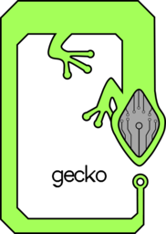

# reptilia
SystemVerilog RISC-V implementation and libraries

## Build/Verify

Before building you need to install two different tools, RISCV-GNU, and LLVM. 
Once these are installed you need to set three environment variables to point to
where these are installed.
- $LLVM_ROOT
- $RISCV_GNU_ROOT

The RTL can then be verified by running `./build.py`, which will compile the
test programs, generate the verilator models, and then compile the verilator
models with the test programs loaded into memory.

## Cores

### Gecko
Small RV32I core with flexible memory interfaces and lightweight AXI interfaces

### Basilisk
Gecko core with both integer math, floating point, and vector extensions

## Repository Structure

- `rtl/`
	SystemVerilog (\*.sv) files containing modules that are going to be synthesized into logic
- `tb/`
	SystemVerilog testbenches for verifying the RTL behavior
- `tb_cpp/`
	C++ testbenches for verifying the RTL behavior with Verilator
- `tests/`
	C/C++/Assembly code for verifying RISC-V core behavior
- `wrappers/`
	SystemVerilog wrappers for verilating/linting RTL files with top-level interfaces
