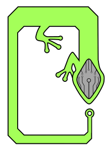

# reptilia
SystemVerilog RISC-V implementation and libraries

## Build/Verify

Before building, install [uv](https://docs.astral.sh/uv/), the RISC-V GNU
toolchain, and Verilator. Add both tools' `bin` directories to `PATH`:

```sh
export PATH="<verilator-prefix>/bin:<riscv-prefix>/bin:$PATH"
```

The build discovers `riscv64-unknown-elf-gcc`,
`riscv64-unknown-elf-objcopy`, `riscv64-unknown-elf-objdump`, and `verilator`
from `PATH`. It queries Verilator for its runtime include directory.

Install the locked Python environment with `uv sync`. The RTL can then be
verified by running `uv run ./main.py`, which will compile the test programs,
generate the Verilator models, and then compile the Verilator models with the
test programs loaded into memory. Ninja and the other Python dependencies are
provided by the uv environment.

Run the complete RV32UI test suite against the Gecko simulator with
`uv run ./main.py --riscv-tests`. Add `--dhrystone` to also run the
Dhrystone benchmark, or use `--dhrystone` by itself.

The memory and stream libraries are verified with Rust testbenches using
[rustdv](https://github.com/rustdv/rustdv). Run both families with:

```sh
uv run ./main.py --rustdv-tests
```

These runs are deterministic through `RUSTDV_RANDOM_SEED`. Optional waveforms
are available as VCD or FST, with one file per test target and seed:

```sh
uv run ./main.py --rustdv-tests --wave fst
uv run ./main.py --rustdv-tests --wave vcd --wave-dir build/my-waves
```

FST tracing requires `liblz4`; untraced and VCD runs do not.
Each RTL family owns its Rust crate, flattened simulation tops, and a discovered
`test/test.py` target manifest under its `rtl/<family>` directory.

## Cores

### Gecko
Small RV32I core with flexible memory interfaces and lightweight AXI interfaces



### Basilisk
Gecko core with both integer math, floating point, and vector extensions

## Repository Structure

- `rtl/`
	SystemVerilog modules/packages that are going to be synthesized into logic
- `tb/`
	SystemVerilog testbenches for verifying the RTL behavior
- `cpp/`
	C++ testbenches for verifying the RTL behavior with Verilator
- `tests/`
	C/C++/Assembly code for verifying RISC-V core behavior
- `wrappers/`
	SystemVerilog wrappers for verilating/linting RTL files with top-level interfaces
